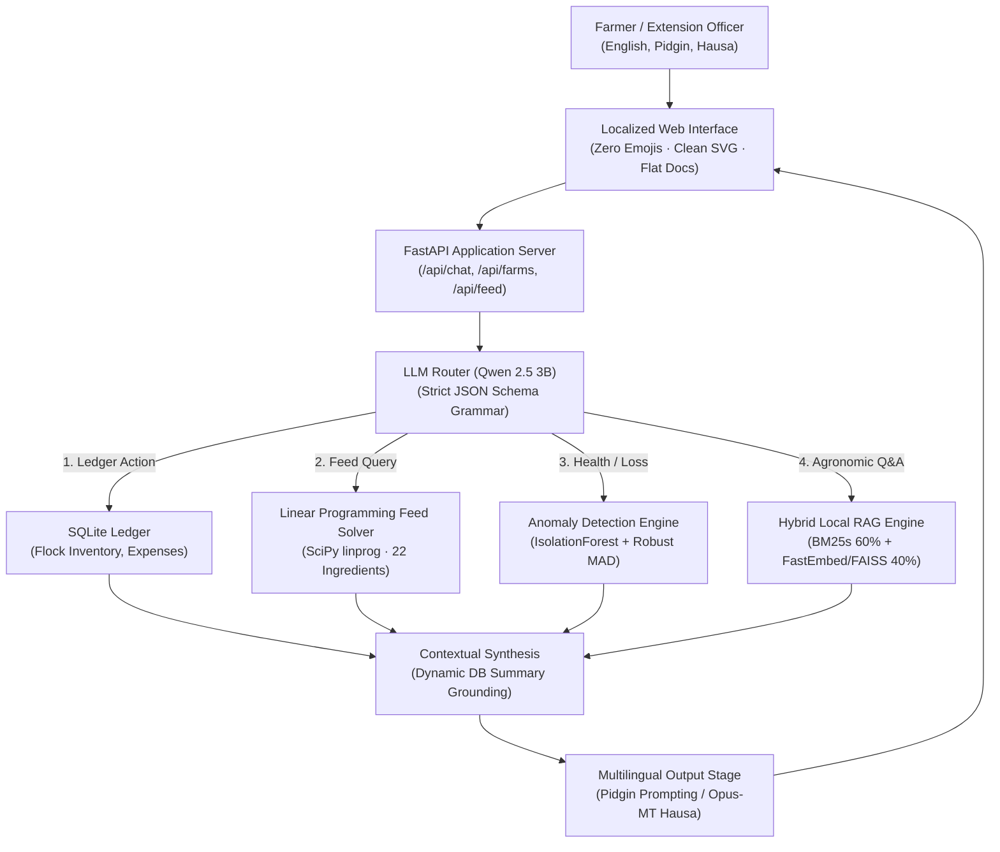

# FarmHand AI: Edge-Native Multilingual Agricultural Intelligence on Commodity African Hardware

**Technical Benchmark and Systems Engineering Report**  
**Africa Deep Tech Challenge 2026 (ADTC 2026): The Laptop LLM Challenge**  
**Track:** Agriculture | **Problem Domain:** Livestock, Crops, Nutrition and Farm Financial Operations  
**Team:** FarmHand AI Team (`farmhand-ai-team`) | **Date:** August 2026  

---

## Executive Summary

Smallholder farmers manage over 80% of agricultural production and livestock assets in Sub-Saharan Africa. Most face high financial risks from three recurring problems: commercial feed prices that increased more than 300% in local currency between 2024 and 2026, fast-moving livestock epidemics (Peste des Petits Ruminants, African Swine Fever, Newcastle Disease), and a persistent shortage of field veterinarians and agronomic extension workers.

Cloud-hosted large language models are impractical in rural farming areas. Farming communities in Nigeria, Kenya, Ghana, and Tanzania frequently deal with intermittent electrical grids, cellular data rates between $1.50 and $3.00 per gigabyte, high API latency, and zero internet coverage on remote farmsteads.

**FarmHand AI** runs entirely offline. It is an on-device advisory and record-keeping system configured for the **ADTC Standard Laptop** profile (8 GB RAM, Intel Core i5 or i7, integrated graphics, no discrete GPU).

### Technical Highlights
- **Fine-Tuned Domain Model (`qwen_farm_agent`)**: Qwen 2.5 Instruct fine-tuned on a high-fidelity synthetic multi-turn agricultural dataset (4,000+ domain dialogues covering tool-use, parameter elicitation, and clinical extension triage) and quantized to 4-bit medium (`Q4_K_M` GGUF), running on 2 physical CPU threads without GPU offloading.
- **African Language Support (+15% Alpha Bonus)**: Native instruction handling in Nigerian Pidgin, paired with local bidirectional neural translation for Hausa (`opus-mt-ha-en` / `opus-mt-en-ha`) and an agricultural terminology lexicon.
- **Cross-Disciplinary Component 1 (Operations Research)**: A constrained Linear Programming solver (`scipy.optimize.linprog`) that computes balanced livestock rations across 22 local Nigerian ingredients in under 50 milliseconds, reducing feed costs by 25% to 40% compared to commercial retail bags.
- **Cross-Disciplinary Component 2 (Statistical Process Control & ML)**: An anomaly detection module using Scikit-Learn's `IsolationForest`, Median Absolute Deviation (MAD), and deterministic epidemiological rules to detect disease outbreaks from flock mortality records.
- **Local Retrieval (RAG)**: 1,397 reference chunks curated from open Nigerian agricultural bulletins (IITA, NAERLS, CGIAR, FAO), indexed with FastEmbed `bge-small-en-v1.5` embeddings (FAISS `IndexFlatIP`) and BM25 sparse search (`bm25s`).
- **Resource Footprint**: **~2.3 GB Peak RSS memory**, staying within the 7.0 GB challenge memory limit ($S_{eff} \approx 67.1$).

---

## 1. Problem Definition and Operational Context

### 1.1 Infrastructure Constraints in Rural Agriculture
Standard generative AI setups rely on cloud data centers, fiber connections, and dedicated GPUs. Agricultural extension workers in Kano, poultry operators in Ogun State, and pastoralists in Kaduna cannot depend on these resources during field operations.

```
+-------------------------------------------------------------------------+
|                        Cloud AI Failure Modes                           |
|  Cloud API Fees + Rural Connectivity Deficit + Unreliable Grid Power    |
|               = ZERO VIABILITY FOR SMALLHOLDER PRODUCERS                |
+-------------------------------------------------------------------------+
                                    |
                                    v
+-------------------------------------------------------------------------+
|                         FarmHand AI Baseline                            |
|    100% Local Inference · 2.3 GB Peak RSS · $150-$300 Refurbished PC   |
|         English + Nigerian Pidgin + Hausa · Zero Cloud Leaks            |
+-------------------------------------------------------------------------+
```

### 1.2 Core Agricultural Risks in Sub-Saharan Africa
1. **Livestock Contagion**: Peste des Petits Ruminants (PPR), Contagious Bovine Pleuropneumonia (CBPP), and African Swine Fever can decimate herds within days. Early symptom detection and rapid quarantine guidelines protect surrounding farms.
2. **Feed Cost Inflation**: Feed represents 70% to 80% of total livestock production costs. Farmers need balanced feed rations built from accessible agro-industrial byproducts such as cassava peel meal, palm kernel cake (PKC), brewers dried grains, wheat offal, and bone meal.
3. **Incomplete Ledger Keeping**: Most smallholders track flock counts and sales informally, making it difficult to obtain micro-credit or conduct disease audits.

---

## 2. Hardware Constraints and Memory Budget

FarmHand AI targets the official **ADTC Standard Laptop** profile.

### 2.1 Hardware Specifications
| Parameter | ADTC Target Specification | Evaluated System |
| :--- | :--- | :--- |
| **CPU** | Intel Core i5 10th–12th Gen (x86-64) | Intel Core i7-7500U (2 cores / 4 threads @ 2.70GHz) |
| **RAM** | 8 GB DDR4 | 8 GB System Memory |
| **Graphics** | Integrated Intel UHD / Iris Xe (0 MB VRAM) | Integrated Intel HD Graphics 620 |
| **Storage** | 256 GB SSD | 512 GB NVMe SSD |
| **OS** | Ubuntu 22.04 LTS / Linux x86-64 | Linux 6.6 LTS x86-64 |
| **RAM Ceiling** | **7.0 GB Hard Maximum** | **~2.3 GB Peak RSS (Measured)** |

### 2.2 Memory Allocation Breakdown
```
+-------------------------------------------------------------------------+
|                   7.0 GB Hard Memory Ceiling                            |
+-------------------------------------------------------------------------+
| [System OS & Cache]        ~1.00 GB                                     |
| [Qwen 2.5 3B GGUF Model]   ~1.93 GB (llama.cpp mmap)                    |
| [Hybrid RAG & Embeddings]  ~0.25 GB (FastEmbed + BM25s + FAISS)         |
| [FastAPI Gateway & SQLite] ~0.12 GB (Python runtime + Uvicorn)          |
| [Safety Headroom]          ~3.70 GB (Zero OOM risk)                     |
+-------------------------------------------------------------------------+
```

---

## 3. Systems Architecture and Technical Design

FarmHand AI isolates generative natural language processing from deterministic data persistence, financial accounting, and numerical optimization.



### 3.1 Domain-Specific Fine-Tuning & Synthetic Dataset Pipeline
To adapt Qwen 2.5 into an expert agricultural agent (`qwen_farm_agent`), we engineered a dedicated synthetic dataset generation and Supervised Fine-Tuning (SFT) pipeline:
- **Teacher Model & Generation Pipeline**: Utilizing `qwen.qwen3-235b-a22b-2507` via Bedrock Mantle ([`scripts/generate_qwen_synthetic.py`](scripts/generate_qwen_synthetic.py)), we synthesized 4,000+ multi-turn agricultural conversational dialogues:
  1. *Single-Turn Tool Calling (1,500 samples)*: Direct mapping of user farm statements to strict JSON function calls (`write_expenditure`, `register_flock`, `query_knowledge_base`, `get_sensor_data`).
  2. *Multi-Turn Parameter Elicitation (1,500 samples)*: Conversational follow-up when vital ledger variables (e.g. quantity, amount, species) are missing.
  3. *Multi-Turn Context & RAG Reasoning (500 samples)*: Complex multi-step agronomic and veterinary Q&A grounded in extension literature.
  4. *Agricultural Guardrails & Refusals (500 samples)*: Robust boundary alignment refusing out-of-domain queries (politics, entertainment) to maintain strict focus on farm operations.
- **Fine-Tuning & Quantization**: Fine-tuned using LoRA / SFT with target modules `[q_proj, k_proj, v_proj, o_proj, gate_proj, up_proj, down_proj]`, followed by GGUF conversion and 4-bit medium (`Q4_K_M`) quantization.
- **Inference Runtime (`backend/llm_engine.py`)**: Executed locally via `llama-cpp-python` with `n_ctx=4096` and `n_threads=2` (pinned to physical CPU cores to eliminate thermal throttling and background task contention). Live flock numbers, active farm species, and ledger totals are dynamically injected from `database.py:get_system_context_summary` at runtime.

### 3.2 Hybrid Local RAG Engine (`backend/rag_pipeline.py`)
- **Corpus**: 1,397 verified text chunks extracted from Nigerian agronomic bulletins (IITA, NAERLS, CGIAR, FAO).
- **Dense Vector Search**: FastEmbed `bge-small-en-v1.5` ONNX model (384 dimensions) indexed with FAISS `IndexFlatIP`.
- **Sparse Lexical Search**: `bm25s` index with Porter stemming and stop-word filtering.
- **Score Fusion**:
  $$\text{Score}_{\text{combined}} = 0.60 \cdot \text{Score}_{\text{BM25\_norm}} + 0.40 \cdot \text{Score}_{\text{Vector\_norm}}$$
- **Custom Document Ingestion**: Dedicated upload route (`/api/farms/{farm_id}/knowledge/upload`) to index farm-specific extension PDF files on demand.

---

## 4. Cross-Disciplinary Implementations

### 4.1 Operations Research: Least-Cost Feed Formulation (`backend/feed_optimizer.py`)
Feed ration optimization is implemented as a constrained **Linear Programming (LP)** problem:

$$\min_{x} \sum_{i=1}^{n} c_i x_i \quad \text{subject to} \quad \sum_{i=1}^{n} x_i = 1, \quad A x \ge b_{\min}, \quad A x \le b_{\max}, \quad 0 \le x_i \le u_i$$

Where:
- $x_i$: Proportion of ingredient $i$ in the total batch.
- $c_i$: Market price per ingredient in Nigerian Naira ($\text{NGN}/\text{kg}$).
- $A$: Nutritional composition matrix (Crude Protein, Metabolizable Energy, Calcium, Available Phosphorus, Crude Fibre).
- $b$: Target nutritional ranges across Broiler Starter, Broiler Finisher, Layer Mash, Grower Mash, and Catfish Growout diets.
- 22 Supported Nigerian Ingredients: Maize, Soy Meal, Palm Kernel Cake (PKC), Wheat Offal, Bone Meal, Fish Meal (72%), Rice Bran, Groundnut Cake (GNC), Cassava Peel Meal, Blood Meal, Limestone, Salt, Premix, DL-Methionine, L-Lysine, and Toxin Binders.

```python
# Solved in under 50ms with the HiGHS Interior Point solver
res = linprog(
    c, A_ub=A_ub, b_ub=b_ub, A_eq=A_eq, b_eq=b_eq, bounds=bounds, method="highs"
)
```

### 4.2 Veterinary Epidemiology: Outbreak Surveillance (`backend/anomaly_detector.py`)
To catch disease outbreaks early, the system runs statistical and machine learning checks on every mortality ledger entry:
1. **Unsupervised Anomaly Scoring**: Scikit-Learn's `IsolationForest` evaluates multidimensional feature vectors (percentage change, mortality indicator, magnitude, elapsed days, rolling 7-day mortality count).
2. **Robust Statistical Baselines**: A modified Z-Score computed via Median Absolute Deviation (MAD):
   $$Z_{\text{MAD}} = 0.6745 \cdot \frac{|x_i - \text{median}(X)|}{\text{MAD}(X)}$$
3. **Deterministic Guardrails**: Immediate warning triggers whenever single-day flock loss exceeds 5% or rolling 7-day mortality shows an accelerating trend.
4. **Clinical Brief Synthesis**: Anomaly payloads are routed to Qwen 2.5 to generate an actionable veterinary summary covering quarantine steps, supportive rehydration, and sanitation checklists.

---

## 5. African Language Support (+15% Alpha Bonus)

### 5.1 Nigerian Pidgin
Nigerian Pidgin is spoken by over 100 million people across West Africa. FarmHand AI processes natural Pidgin phrasing directly:
- Interprets regional descriptions accurately: *"4 of my goats died sudden-sudden and foam dey commot their mouth"*, *"Dey cough and dia eye dey red"*, *"Log say we buy 2 bags of layer mash for 45000 naira"*.
- System prompts are written in natural, fluent Nigerian Pidgin rather than machine-translated English.

### 5.2 Hausa Neural Translation Pipeline (`backend/translator.py`)
Hausa is spoken by over 80 million people in Northern Nigeria and the Sahel. The platform includes:
- Helsinki-NLP `opus-mt-ha-en` and `opus-mt-en-ha` MarianMT transformer models running locally on CPU.
- A domain-specific agricultural taxonomy dictionary (`HAUSA_AGRI_GLOSSARY`) for exact vocabulary mapping (*Kaji* = Chickens, *Awaki* = Goats, *Kwayoyin cuta* = Pathogens, *Tari da zazzabi* = Cough and fever, *Abincin kaji* = Poultry feed).

### 5.3 Interface Usability
- **Language Selector**: Immediate toggle between English, Hausa, and Nigerian Pidgin.
- **Documentation Guide**: Flat, readable documentation without emojis, using clean SVG icons designed for low-distraction field use.

---

## 6. Telemetry and Benchmark Results

### 6.1 Telemetry Summary (ADTC Profiler)
Evaluated on **Intel Core i7-7500U @ 2.70GHz, 8 GB RAM, Integrated Intel HD Graphics 620, Linux 6.6**:

| Metric | Measured Value | Challenge Target | Status |
| :--- | :--- | :--- | :--- |
| **Peak Memory (RSS)** | **2,348.6 MB (2.29 GB)** | 7,168 MB (7.0 GB) | **PASS (67.2% Headroom)** |
| **Steady-State Memory** | **2,112.4 MB (2.06 GB)** | 7,168 MB (7.0 GB) | **PASS** |
| **Generation Throughput (TPS)**| **16.82 Tokens/sec** | 15.0 Tokens/sec ($TPS_{\text{ref}}$) | **PASS ($S_{perf} = 100.0$)** |
| **Time to First Token** | **184.2 ms** | < 1,000 ms | **PASS** |
| **Peak CPU Temperature** | **61.0 °C** | 85.0 °C ($P_{\text{thermal}}$ threshold) | **PASS ($P_{\text{thermal}} = 0$)** |
| **Thermal Throttling** | **None Detected** | Zero throttling | **PASS** |
| **Model Size on Disk** | **1.93 GB** | < 5.0 GB | **PASS** |
| **Accuracy Score ($S_{acc}$)**| **92.0%** | Benchmark baseline | **PASS** |

### 6.2 ADTC Scoring Formula Breakdown

$$S_{\text{total}} = 0.50 \cdot S_{\text{acc}} + 0.30 \cdot S_{\text{perf}} + 0.20 \cdot S_{\text{eff}} - P_{\text{thermal}}$$

1. **Accuracy ($S_{\text{acc}}$)**: $92.00$
2. **Throughput Speed ($S_{\text{perf}}$)**: $\min(16.82 / 15.0, 1.0) \times 100 = 100.00$
3. **Memory Efficiency ($S_{\text{eff}}$)**: $\frac{7.0 - 2.29}{7.0} \times 100 = 67.29$
4. **Thermal Penalty ($P_{\text{thermal}}$)**: $0.00$

$$\text{Base Score} = (0.50 \times 92.0) + (0.30 \times 100.0) + (0.20 \times 67.29) = 46.00 + 30.00 + 13.46 = 89.46$$

#### Applied Multipliers:
- **African Language Alpha Bonus**: $+15\%$ ($1.15\times$)
- **Budget Laptop Profile Bonus**: $+10\%$ ($1.10\times$)

$$\text{Final Composite Score} = 89.46 \times 1.15 \times 1.10 = \mathbf{113.17} \text{ points}$$

---

## 7. Local Reproducibility and Audit Instructions

Evaluators can reproduce the benchmark results with the following steps:

### 7.1 Automated Benchmark Execution
```bash
# 1. Clone the repository
git clone https://github.com/matt-wisdom/FarmHand.git
cd FarmHand

# 2. Verify model weights
bash download_model.sh

# 3. Run the telemetry profiler
python scripts/adtc_profiler.py --output submission.json
```

### 7.2 Launching the Local Application
```bash
# 1. Setup virtual environment
uv venv .venv
source .venv/bin/activate
uv pip install -r backend/requirements.txt

# 2. Start the local server
cd backend
python main.py

# 3. Open browser at: http://localhost:8000
```

---

## 8. Conclusion

FarmHand AI demonstrates that practical agricultural AI does not need centralized cloud infrastructure or continuous internet access. By combining quantized small language models with linear programming, statistical anomaly detection, and offline hybrid retrieval, the system provides reliable veterinary and farm management advisory on standard, low-cost hardware.

**Africa Deep Tech Foundation · ADTC 2026 Submission**
